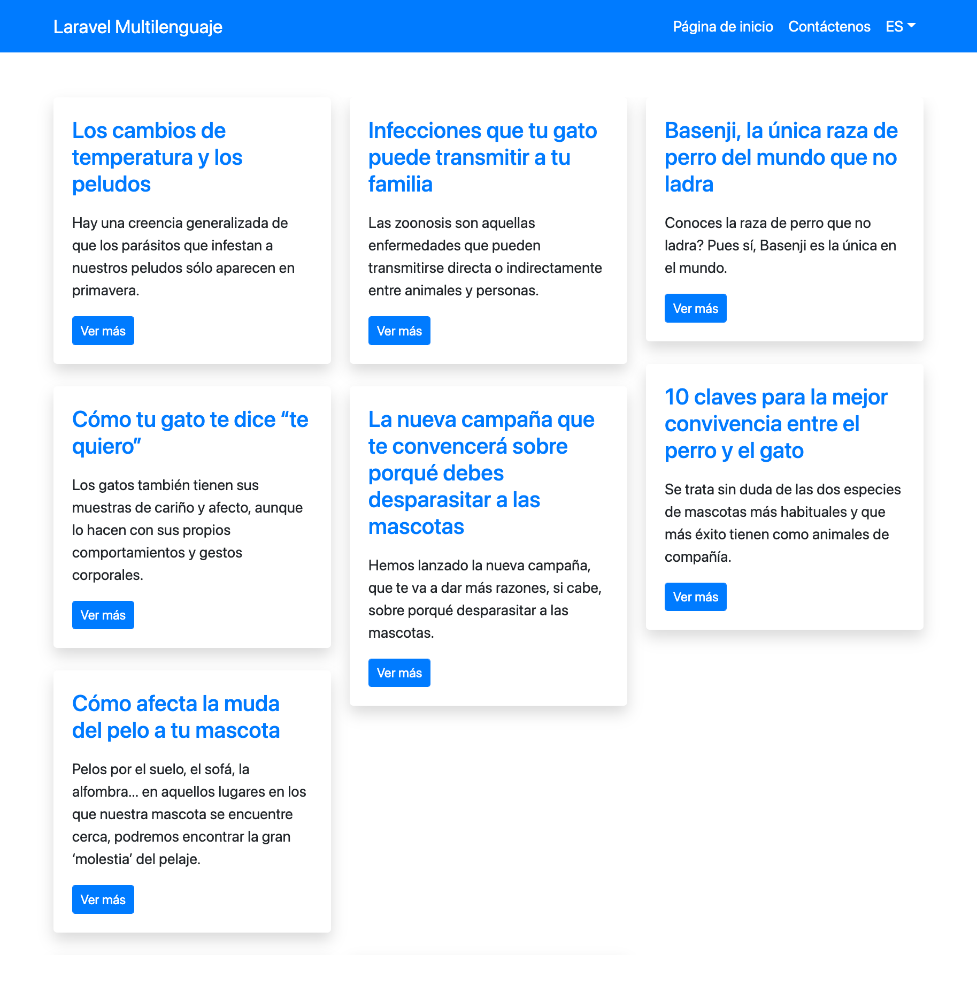
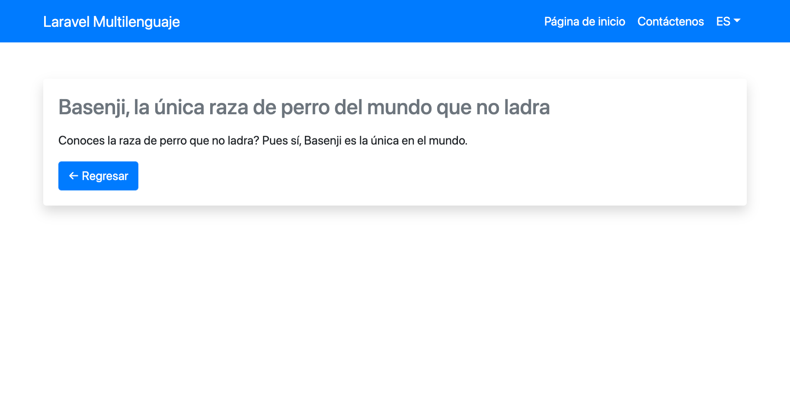

## Laravel multilenguaje

Este es un ejemplo de como implementar Laravel en varios idiomas.

### Instalación

### Paso 1

```
composer install
````

### Paso 2

```
php artisan key:generate
````

### Paso 3

Crea tu archivo .env usando de ejemplo el archivo .env.example:

```
cp .env.example .env
````

### Paso 4

Modifica tu archivo .env con la configuración de tu base de datos.

### Paso 5

```
php artisan migrate
````

### Paso 6

```
php artisan db:seed
````

### Capturas de pantalla

#### Listado de páginas



#### Página interior



### Problemas conocidos

#### Problema

```
Illuminate\Database\QueryException 

SQLSTATE[42S02]: Base table or view not found: 1146 Table 'laravel_multilang.settings' doesn't exist (SQL: select * from `settings` where `option` = site_default_locale limit 1)
```

```
Illuminate\Database\QueryException 

SQLSTATE[42S02]: Base table or view not found: 1146 Table 'laravel_multilang.languages' doesn't exist (SQL: select `locale` from `languages`)
```

#### Solución

Comenta todo el código del archivo: routes/web.php y ejecuta el siiguiente comando:

```
php artisan migrate
```

#### Problema

```
Call to undefined function get_language_switcher_url() (View: /Users/edgar/Development/PHP/multi-language-laravel-example/resources/views/includes/menu.blade.php)
```

#### Solución

Ejecuta el comando siguiente:

```
composer dumpautoload
```